# 📝 Exam Conducting Platform

A secure and scalable **online exam conducting platform** built with **Python, Django, Django REST Framework (DRF), PostgreSQL, and Bootstrap**.  
This platform manages the **complete examination lifecycle** — from multi-stage candidate registration to live exam execution, proctoring, result processing, and downloadable PDFs.

---

## 🚀 Key Features

### 🔐 Multi-Stage Registration & Verification
- Step-by-step candidate registration
- Email verification
- Educational details submission
- Photo upload
- Automatic application form generation (PDF)

---

### 📚 Exam Lifecycle Management
- View and select available exams
- Exam confirmation before start
- Live exam engine with countdown timer
- Automatic submission on time expiry
- Secure result evaluation and display

---

### 🎥 Live Proctoring & Warning System
- Continuous monitoring during the exam
- Violation detection with **warning counter (0 / 3)**
- Automatic exam termination after exceeding limits

---

### 📄 PDF Generation
- Downloadable **Application Form PDF**
- Downloadable **Result PDF**
- Clean, printable, official-style format

---

### 🛠️ Admin Panel (Jazzmin)
- Publish and manage exams
- Review candidate applications
- Monitor exam progress and violations
- View and manage results
- Modern UI powered by **Jazzmin**

---

## 🧑‍💻 Tech Stack

| Layer | Technology |
|------|-----------|
| Backend | Python, Django |
| API | Django REST Framework |
| Database | PostgreSQL |
| Frontend | HTML, CSS, Bootstrap |
| Admin UI | Django Jazzmin |
| PDF | ReportLab / WeasyPrint |

---

## 📷 Screenshots

### 🧾 Registration & Application Flow
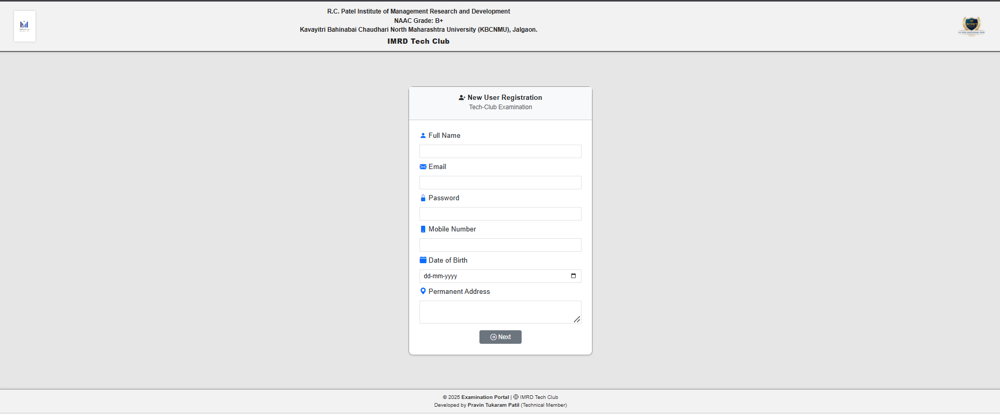
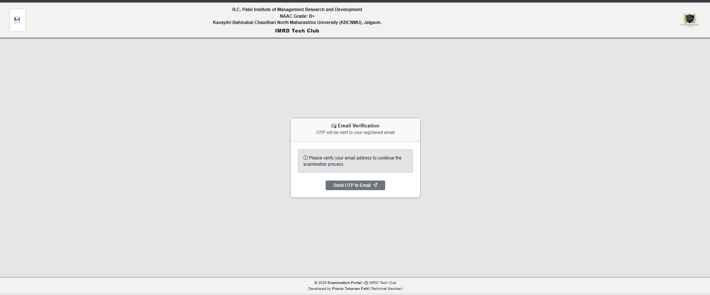
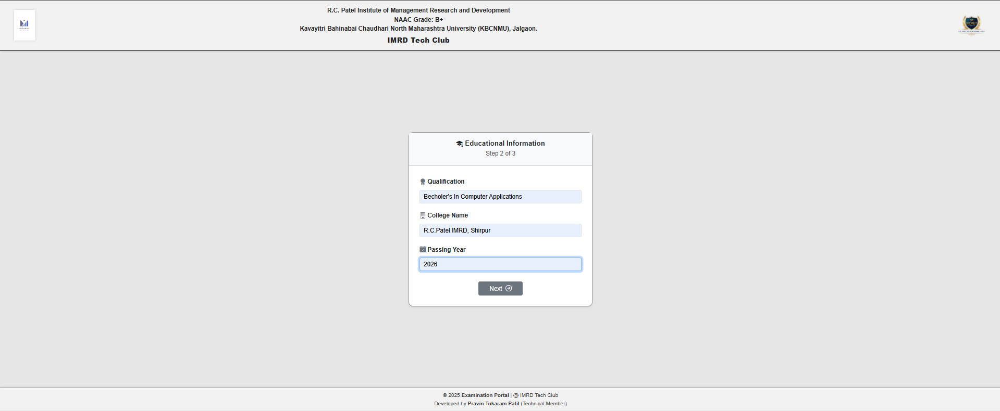
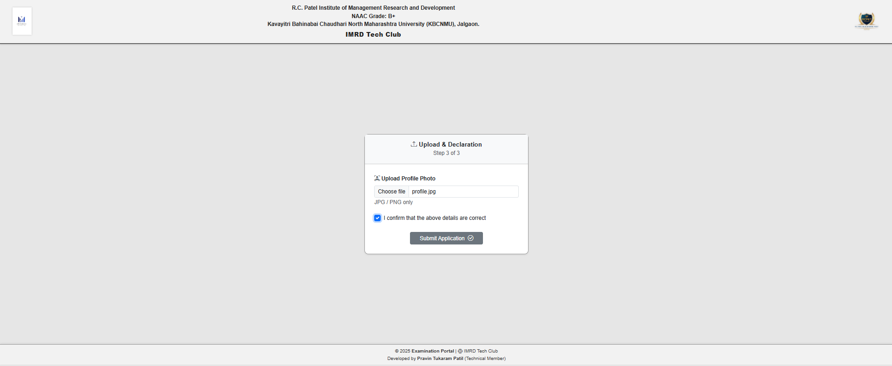
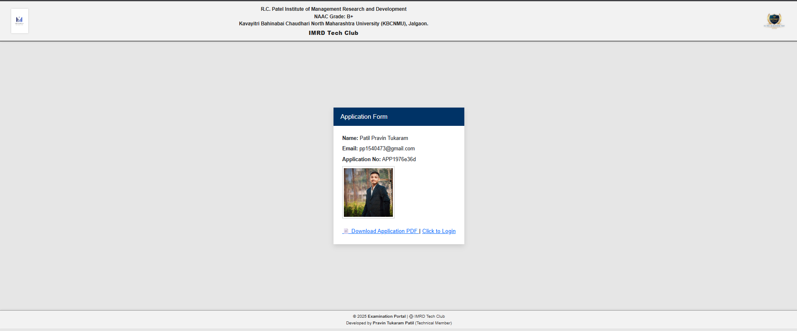
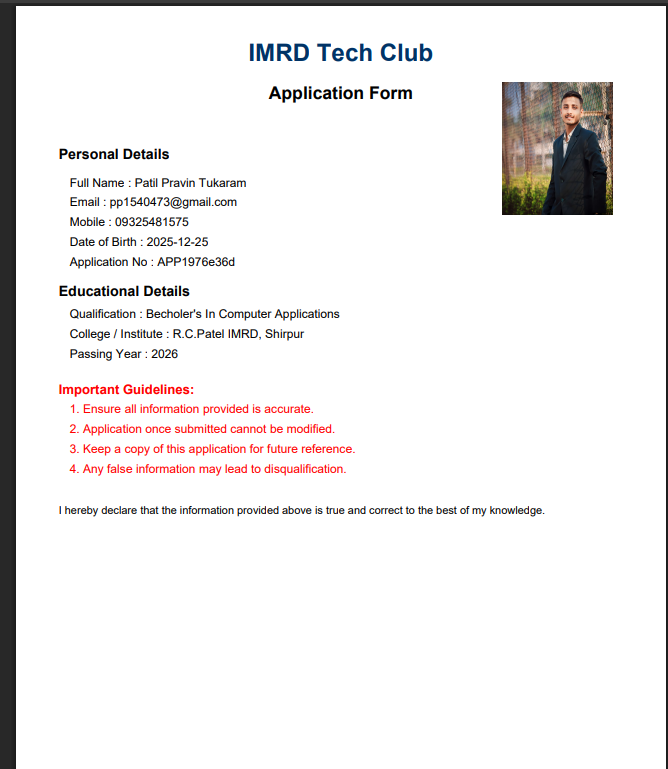

---

### 🔑 Authentication
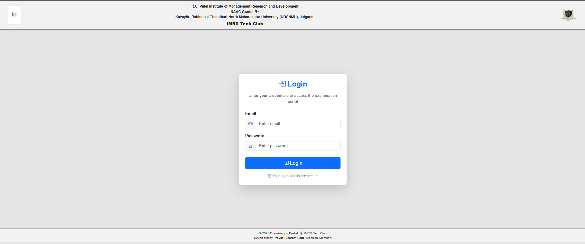

---

### 📚 Exam Process
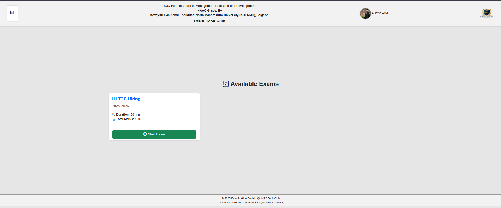
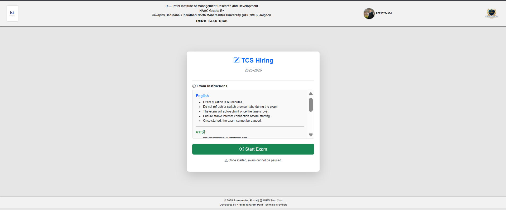
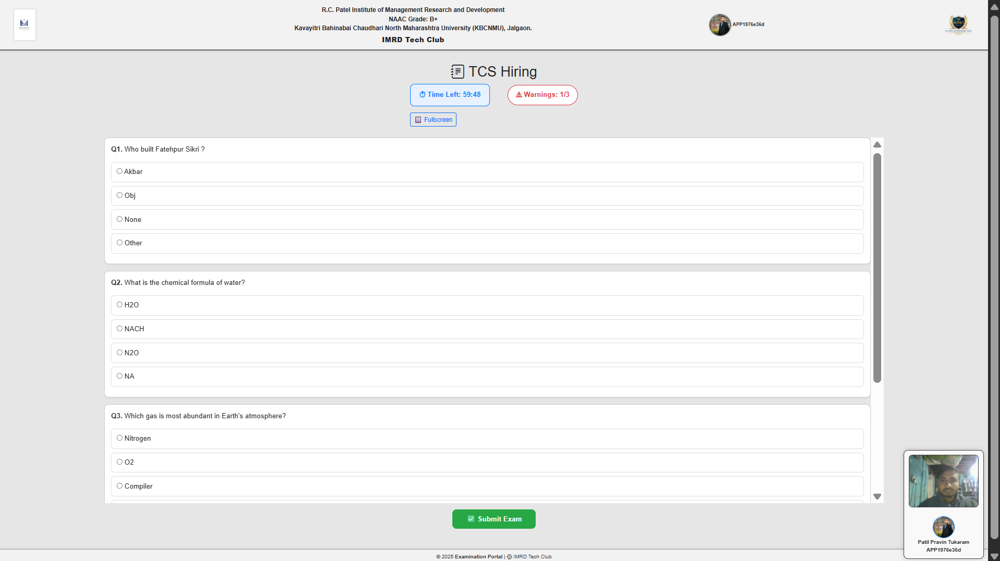
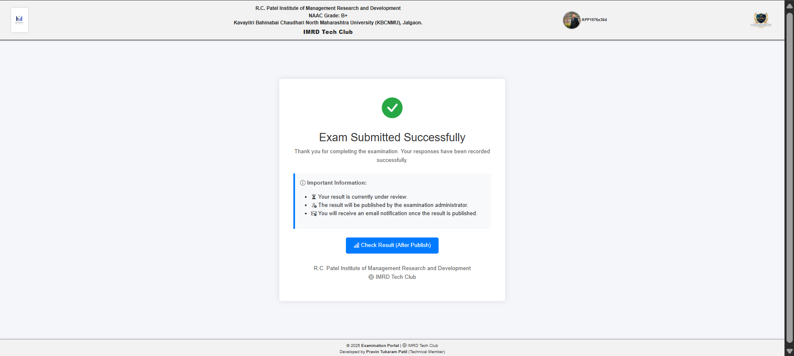

---

### 📊 Result System
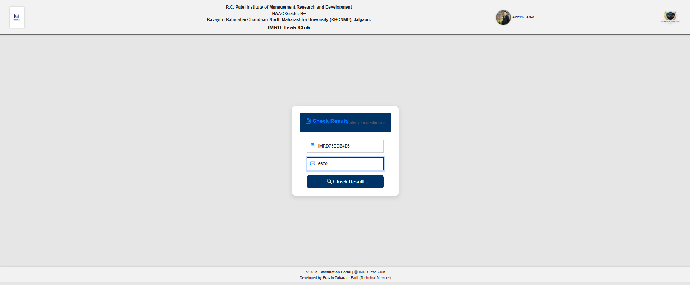
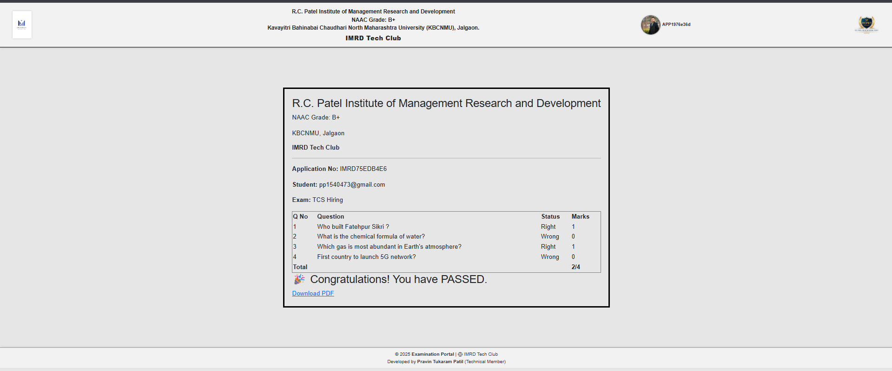
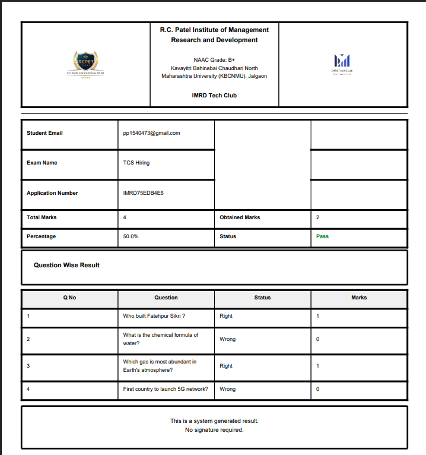

---

### 🛠️ Admin Panel (Jazzmin)
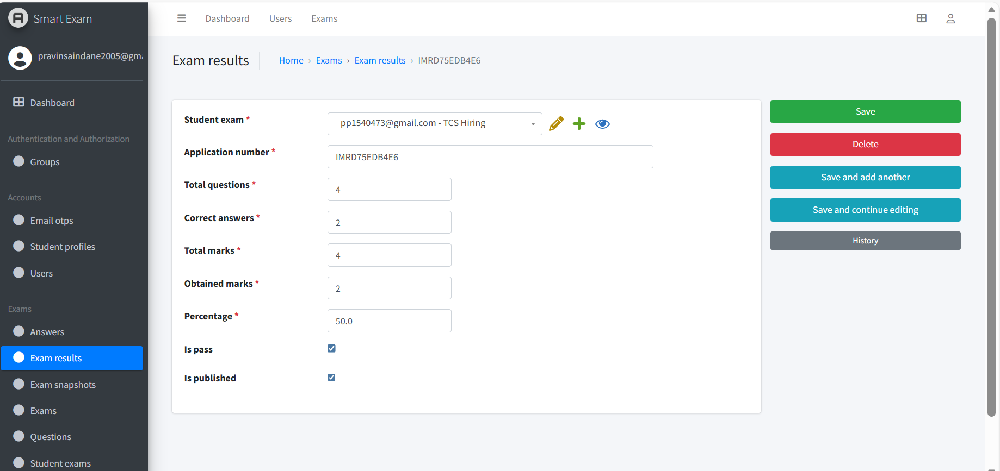

---

## ⚙️ Local Setup

```bash
git clone https://github.com/yourusername/exam-conducting-platform.git
cd exam-conducting-platform

python -m venv venv
venv\Scripts\activate

pip install -r requirements.txt
python manage.py migrate
python manage.py runserver
